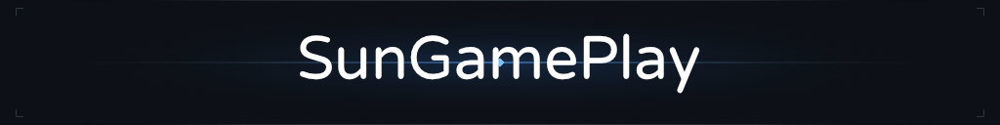

**[Click me](https://sungameplay.github.io/SunGamePlay/) for my personal webpage!**

Hello, I am a **Data Science + AI** graduate.

## About Me
* 🎓 Education : Pursuing a Bachelor’s in Data Science with an Extended Major in Artificial Intelligence at Hong Kong University of Science and Technology.
* 💻 Interests : Data analysis, predictive modeling, machine learning, and harnessing AI to address practical, impactful problems.
* 🌟 Goals : Develop meaningful projects, collaborate with diverse teams, and continuously grow in the dynamic fields of data science and AI.

## Skills
* **Programming Languages:** Python, R, SQL, Java, C++, TypeScript, JavaScript, HTML/CSS
* **Data Science & AI:** TensorFlow, Scikit-learn, Pandas, NumPy, Predictive Modeling, Statistical Analysis, Data Cleaning
* **Data Visualization:** Tableau, Matplotlib, Seaborn, ggplot2
* **Web & Software Development:** React.js, Node.js, Express, Socket.IO, jQuery
* **Databases & Tools:** MapDB, Jupyter, MS Excel